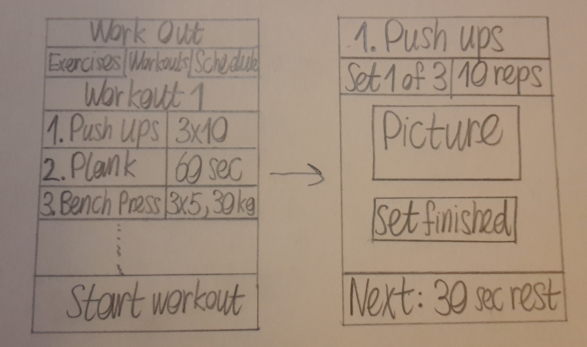
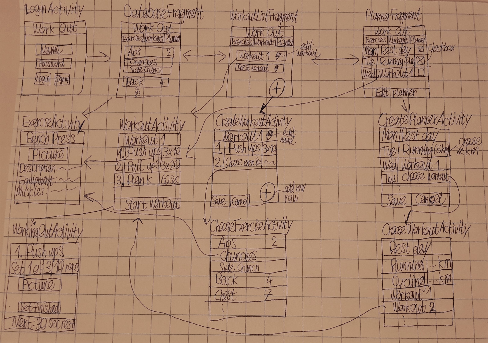
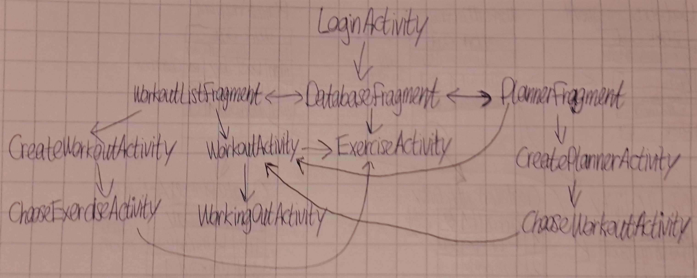

# Week 1

## Dag 2, 6-6-17

* Gezocht naar een goede API met oefeningen. https://wger.de/api/v2 lijkt
goed te zijn, maar de API is niet precies hoe ik hem wil hebben: weinig plaatjes
en soms geen goede uitleg van de oefening. Ik ga hier nog over nadenken.
* *Project Proposal* geschreven en nagedacht over de precieze inhoud van de app.
* Schetsen van verschillende onderdelen van de app gemaakt:

## Dag 3, 7-6-17

* Stand-ups gedaan samen met studiegenoten. Ze vonden de app een leuk idee
en gaven goede feedback.
* Begin gemaakt aan het *Design Document* en het prototype.
* Ik heb de API van *wger* gebruikt om een Firebase database te maken, zodat de database
precies de structuur heeft die ik nodig heb. Veel werk en veel tekst herschreven.

## Dag 4, 8-6-17

* Bij de stand-ups is opnieuw goede feedback gegeven. Ik had nog niet goed
nagedacht over hoe ik precies de workouts van een gebruiker wilde opslaan.
Ik heb besloten dit in Firebase te zetten, en dus ook gebruik te maken van
de Firebase authenticatie.
* LoginActivity geïmplementeerd met behulp van Firebase authenticatie.
* Exercise en Workout classes aangemaakt. De Exercise class haalt een
JSONObject op uit de Firebase database en zet het om in een bruikbaar object.
Verder bestaat de Workout class uit verschillende Exercise objects.
Het lijkt me makkelijker om classes te gebruiken dan alleen met JSONObjects
te werken. Aan de ene kant kost het eerst meer tijd om de JSONObjects om te zetten
in Exercise classes. Toch blijkt dat zulke classes vaak handiger zijn om
mee te werken (zo hoef je geen rekening meer te houden met JSONExceptions).
* Aantal kleine dingen aan het prototype gedaan.
* Nieuwe visualisatie van de app gemaakt:

Verder nog een schema met de relaties tussen activities:

## Dag 5, 9-6-17

* Presentatie gehad. Het idee voor de app lijkt te veel op vergelijkbare apps.
Er moet dus nog iets worden toegevoegd. Misschien achievements/een andere beloning
na het voltooien van workouts. Ik ga hier dit weekend nog over nadenken.
* Opnieuw de Firebase database aangepast. De oefeningen zijn nu in een apart
JSONObject per categorie. Dit werkt beter, want in de app moeten de oefeningen
ook gesorteerd op categorie.
* CustomExpandableListAdapter gemaakt voor de DatabaseFragment. Ik heb voor een
ExpandableListView gekozen, aangezien hierdoor elke oefening bij
een bepaalde categorie is geplaatst.
Dit maakt de lijst oefeningen een stuk overzichtelijker.
* Begin gemaakt aan DatabaseFragment. Alle data wordt opgehaald uit Firebase,
alleen er zijn nog enkele bugs aanwezig.

# Week 2

## Dag 1, 12-6-17

* Nagedacht over de feedback van de presentaties. Ik wil een extra tabblad met een profielpagina aanmaken. Hier komt het aantal voltooide workouts te staan (en misschien nog meer) en kun je het kleurenthema van de app veranderen (evt. na een bepaald aantal voltooide workouts).
* Problemen bij DatabaseFragment opgelost en verder DatabaseFragment afgemaakt door een Intent en onChildClickListener toe te voegen.
* ImageAsyncTask gemaakt om afbeeldingen op te kunnen halen. Het was lastig om de URL mee te geven aan de ImageView bij het intialiseren van een nieuwe ImageAsyncTask, maar dit is gelukt door imageView.setTag() te gebruiken.
* ExerciseActivity gemaakt en het layout-bestand ingericht. Ik heb bij deze layout gekozen voor een ScrollView, aangezien anders de tekst van het scherm zou kunnen gaan.
* Ik moet nog nadenken over de grootte en schaal van de afbeeldingen bij de oefeningen. Sommige afbeeldingen zijn namelijk heel breed en andere zijn vooral in de lengte groot. Ik heb nu het minimum van een vaste waarde en (een factor van) de grootte van de afbeelding gekozen, maar enkele zijn nog niet perfect.

## Dag 2, 13-6-17

* Bij de stand-ups de voortgang van de vorige dag besproken. Julia kwam met een goed idee over het uniek maken van de app: namelijk het toevoegen van sjablonen voor workouts, die de gebruiker kunnen helpen bij het maken van een goede workout. Hierdoor wordt voorkomen dat de gebruiker niet enkel dezelfde spiergroep traint, want dit is niet goed.
* De LoginActivity en Firebase login is weggehaald. In plaats daarvan werk ik nu met 'anonymous authentication'. Hierdoor kan je nog steeds workouts plaatsen in een aparte branch corresponderend met de gebruiker, zonder te hoeven inloggen. Het nadeel hiervan is dat er een nieuwe gebruiker wordt aangemaakt als de app opnieuw wordt geïnstalleerd, waardoor alle data in feite verloren gaat. Dit is bij normaal gebruik geen groot probleem, maar wel vervelend met testen.
* Begonnen met het implementeren van de workouts. Speciale WorkoutListAdapter gemaakt om de Workouts in te plaatsen. De data wordt nu correct uit Firebase gehaald, maar wordt nog niet geüpdatet wanneer er een workout wordt verwijderd, aangezien deze functies nog niet zijn gemaakt.

## Dag 3, 14-6-17

* Layout van CreateWorkoutActivity ingericht. Er kan een titel worden gekozen, een lengte van de workout en eventueel een template. Voor dit laatste deel is er voor een 'spinner'/dropdown menu gekozen.
* CreateWorkoutActivity voor het grootste deel gemaakt. Ik probeer het creëren van workouts af te krijgen voor de alpha-versie.

## Dag 4, 15-6-17

* App bar toegevoegd bij specifieke activities en bij andere de standaard titelbar weggehaald. Dit neemt namelijk veel ruimte op en is onnodig.
* Layout van CreateWorkoutActivity aangepast. In plaats van een vaste lengte te kiezen, wordt er nu op een FloatingActionButton gedrukt om een exercise aan de workout toe te kunnen voegen. Dit lijkt me mooier en ook flexibeler. Wel kan het nu lastiger worden om de templates voor workouts te implementeren.
* Style van de app aangepast van blauw (standaard) naar een donker thema.
* Het lukt nu om workouts te creëren, maar om de een of andere reden lukt het nog niet om de workouts in Firebase op te slaan. Hier ga ik later nog naar kijken.

## Dag 5, 17-6-17 (en weekend)

* Presentatie gehad. Jaap vond het idee van de templates niet slecht, maar hij had een betere oplossing: in plaats van de keuze van de oefening tot een bepaalde spiergroep te beperken, verschijnt er een vooraf gecreëerde workout, die vervolgens aan te passen is.
Verder vond hij het idee met de kleurenthema's die je kunt ontgrendelen niet heel relevant. Ik ga hier nog over nadenken. Ten slotte ga ik bij elke oefening in de ListViews van sommige Activities een plaatje met de getrainde spiergroep toevoegen.
* Regels in Firebase veranderd, nu lukt het wel om de workouts op te slaan.
* WorkoutListFragment afgemaakt. De workouts zijn nu voor het grootste deel werkend.
Er kunnen echter geen twee workouts dezelfde naam hebben; dan wordt de oude workout overschreven. Hier ga ik later naar kijken.
* WorkoutActivity en de layout van deze Activity gemaakt.
