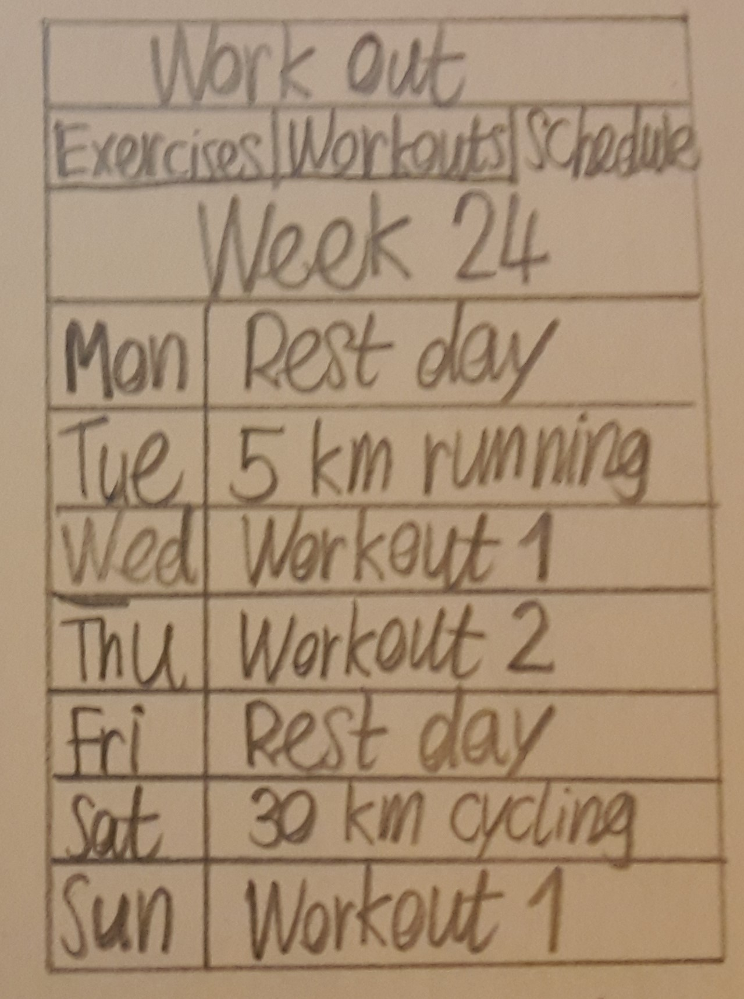

# Dag 1, 6-6-17

* Gezocht naar een goede API met oefeningen. https://wger.de/api/v2 lijkt
goed te zijn, maar de API is niet precies hoe ik hem wil hebben: weinig plaatjes
en soms geen goede uitleg van de oefening. Ik ga hier nog over nadenken.
* *Project Proposal* geschreven en nagedacht over de precieze inhoud van de app.
* Schetsen van verschillende onderdelen van de app gemaakt:

# Dag 2, 7-6-17

* Stand-ups gedaan samen met studiegenoten. Ze vonden het een leuk idee en gaven goede feedback.
* Begin gemaakt aan het *Design Document* en het prototype.
* Ik heb de API van *wger* gebruikt om een Firebase database te maken, zodat de database precies de structuur heeft die ik nodig heb. Veel werk en veel tekst herschreven.
