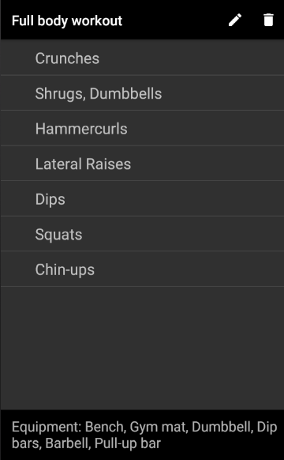
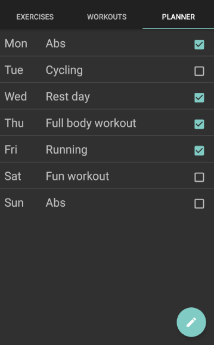

# Work-Out

##### Programmeerproject
##### Minor Programmeren, UvA

###### *Gido Limperg*

*Work-Out* is een fitness-app die de gebruiker probeert inzicht te geven in de mogelijkheden
van een goede workout. Verder heeft de app het doel om (beginnende)
sporters zo veel mogelijk te helpen bij het trainen.

## Beschrijving

In deze fitness-app kan de gebruiker informatie vinden over allerlei oefeningen en aan de hand van deze oefeningen zelf een workout samenstellen. Hierbij kan gebruik worden gemaakt van een sjabloon die de gebruiker helpt bij het kiezen van de verhouding van soorten oefeningen. Ten slotte kunnen deze persoonlijke workouts worden geplaatst in een planner. Bij deze planner kan de gebruiker per dag een activiteit selecteren. Verder kunnen deze activiteiten worden afgevinkt na voltooiing.

## Screenshots

  

## Bronnen

[Toevoegen van een check van de internetconnectie in elke Activity](https://stackoverflow.com/questions/15714122/checking-internet-connection-in-every-activity)

[LongClickListener op een ExpandableListView](https://stackoverflow.com/questions/2353074/android-long-click-on-the-child-views-of-a-expandablelistview)

De database met oefeningen is gedeeltelijk afkomstig van de [*wger* Workout Manager REST API](https://wger.de/en/software/api).

*wger Workout Manager is released under the Affero GNU General Public License (AGPL) Version 3+ and can (under the conditions of the license) be used, modified and distributed (also with modifications) without restrictions.*

## Copyright

 This work is licensed under a <a rel="license" href="http://creativecommons.org/licenses/by-nc-sa/4.0/">Creative Commons Attribution-NonCommercial-ShareAlike 4.0 International License</a>.
Copyright © 2017 Gido Limperg. All rights belong to their respective owners.

