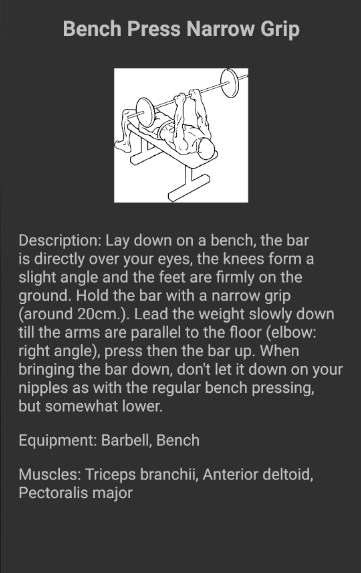

# Work-Out

*Gido Limperg, 11060727*

## Overzicht

In deze fitness-app kan de gebruiker informatie vinden over allerlei oefeningen en aan de hand van deze oefeningen zelf een workout samenstellen. Hierbij kan gebruik worden gemaakt van een sjabloon die de gebruiker helpt bij het kiezen van de verhouding van soorten oefeningen. Ten slotte kunnen deze persoonlijke workouts worden geplaatst in een planner. Bij deze planner kan de gebruiker per dag een activiteit selecteren. Verder kunnen deze activiteiten worden afgevinkt na voltooiing.

## Beschrijving

De app bestaat uit drie onderdelen, die van elkaar gescheiden zijn door middel van tabbladen in de vorm van Fragments. Ten eerste is er een tabblad waarin een lijst met allerlei oefeningen staat, gesorteerd op categorie. Zo staan bijvoorbeeld alle oefeningen die voornamelijk de buikspieren trainen in de categorie 'Abs'. Als er op zo'n oefening geklikt wordt, verschijnt er een scherm met daarin de informatie over de oefening. In deze Activity staat een beschrijving van de oefening, de benodigdheden, de spiergroepen die getraind worden en een afbeelding.

In het tweede tabblad staat een lijst met alle door de gebruiker gecreëerde workouts. Hiervoor moeten natuurlijk eerst deze workouts worden gemaakt, dus er is ook de mogelijkheid om een nieuwe workout toe te voegen. Dit gebeurt in een aparte Activity. Zo'n workout kan worden aangemaakt door zelf oefeningen en een naam te kiezen, maar er is ook een andere mogelijkheid. Er zijn namelijk een aantal 'templates' oftewel sjablonen voor het creëren van een workout. Er kan een template en een lengte van deze template worden gekozen, waarna er een vast gekozen selectie oefeningen in de workout verschijnt. Vervolgens kunnen er ook oefeningen worden verwijderd of toegevoegd aan deze selectie.

Als we een workout hebben gemaakt, kunnen we deze ook bekijken in een aparte Activity. In dit scherm staat de gekozen titel en lijst met oefeningen. Verder staat er het benodigde materiaal voor de workout. Uiteraard kan de workout ook aangepast worden of verwijderd.

Ten slotte bestaat het derde tabblad van de app uit een weekplanner. In deze planner kunnen per dag gecreëerde workouts worden ingepland. De gebruiker kan er ook voor kiezen om een rustdag in te plannen of een fietstocht/hardloopronde. Als een workout is voltooid, kan de gebruiker de betreffende dag afvinken. In een aparte Activity kan de planner gewijzigd worden.

Bij deze app is gebruik gemaakt van Firebase authenticatie en de Firebase database om de workouts en planner per gebruiker op te slaan. Ook wordt de database gebruikt voor de opslag van de oefeningen en templates.

## Technisch

In deze sectie komen alle gemaakte Java classes aan bod. Verder wordt uitgelegd waar de classes belangrijk voor zijn en hoe ze aan elkaar verwant zijn.
Ten eerste worden de volgende classes gebruikt: Exercise, Workout, CheckNetwork en ImageAsyncTask.

* **Exercise:** een Object die alle informatie over een oefening bevat: naam, beschrijving, categorie, spieren, benodigdheden en een afbeelding.
* **Workout:** een Object die een titel bevat en een lijst met oefeningen.
* **CheckNetwork:** een class die een functie bevat waarmee de internetverbinding gecontroleerd kan worden. Verder heeft deze class een functie die een AlertDialog laat zien als er geen internetverbinding is.
* **ImageAsyncTask:** een AsyncTask die een afbeelding vanaf een URL in een Activity laadt.

De eerste drie classes worden in veel verschillende Activities gebruikt. Zo wordt bijvoorbeeld in elke Activity de internetverbinding gecontroleerd. De ImageAsyncTask wordt alleen gebruikt bij het laden van de afbeelding van een oefening.

Verder bestaat de app uit de volgende Activities: MainActivity, ExerciseActivity, WorkoutActivity, CreateWorkoutActivity, ChooseExerciseActivity, en EditPlannerActivity.

* **MainActivity:** verschijnt bij het opstarten. Eerst wordt door middel van Firebase authenticatie een (anoniem) account aangemaakt. Vervolgens worden de tabbladen (Fragments) geladen door middel van een ViewPager. De MainActivity bevat de volgende Fragments:

  * **DatabaseFragment:** bevat een lijst met alle oefeningen. Er is gekozen voor een ExpandableListView, zodat de oefeningen per spiergroep gecategoriseerd zijn. Deze oefeningen worden d.m.v. een ChildEventListener opgehaald uit Firebase. De ListView bevat ook een onChildClickListener die de gebruiker naar de ExerciseActivity van de betreffende oefening stuurt.

  * **WorkoutListFragment:** bevat een lijst met alle workouts. Deze workouts worden d.m.v. een ChildEventListener opgehaald uit Firebase. Verder heeft de ListView een onItemClickListener die de gebruiker naar de WorkoutActivity van de betreffende workout stuurt. Tot slot is er een FloatingActionButton om naar de CreateWorkoutActivity te gaan.

  * **PlannerFragment:** bevat een lijst met de weekplanner. Als er nog geen planner aangemaakt is, wordt er eerst een standaard planner in Firebase gezet d.m.v. de functie setDefaultPlanner. Verder worden opnieuw de workouts met een ChildEventListener uit Firebase opgehaald en is er een onItemClickListener om naar de workout te gaan. Met behulp van CheckBoxes kunnen de workouts in de planner worden opgeslagen. Deze CheckBoxes worden opgeslagen via SharedPreferences. De states van de CheckBoxes worden in de onCreate opgehaald en in de onStop weer opgeslagen. Tot slot is er een FloatingActionButton om naar EditPlannerActivity te gaan en de planner aan te passen.

* **ExerciseActivity:** Activity die alle informatie van een oefening weergeeft. Uit een Intent wordt een Exercise object gehaald, waarna d.m.v. de functie setViews alle TextViews en de ImageView wordt geïnitialiseerd.

* **WorkoutActivity:** bevat informatie over een workout. Via de functie getEquipment worden alle benodigdheden van een workout opgehaald, waarna deze in een TextView geplaatst worden.
Door te klikken op een oefening, ga je naar de betreffende ExerciseActivity. Verder staan in de Toolbar knoppen waarmee de workout aangepast of verwijderd kan worden. Door op 'aanpassen' te klikken, wordt de gebruiker naar CreateWorkoutActivity gestuurd. Als de gebruiker op het verwijder-icoon klikt, verschijnt er een AlertDialog, waarna de keuze om te verwijderen kan worden bevestigd en de workout uit Firebase wordt verwijderd. Vervolgens wordt gecontroleerd of de workout ergens in de planner staat. Als dit zo is, moet de workout ook uit de planner worden verwijderd.

* **CreateWorkoutActivity:** Activity waarin een nieuwe workout kan worden aangemaakt. Ook is dit de Activity waarin bestaande workouts worden aangepast. In een ListView staat de lijst met geselecteerde oefeningen. Door middel van een LongClickListener kunnen deze oefeningen weer verwijderd worden. Met behulp van een Spinner kan de template worden gekozen, en met behulp van een SeekBar kan de lengte van deze template worden gekozen. Deze Views worden geïnitialiseerd in resp. setTemplateSpinner en setSeekBarListener. Als er een nieuwe template of lengte wordt gekozen, wordt de nieuwe template via de functie getTemplate uit Firebase opgehaald.

  Verder is er een FloatingActionButton, welke de functie startActivityForResult aanroept om naar ChooseExerciseActivity te gaan. In de functie onActivityResult wordt vervolgens de nieuwe oefening toegevoegd aan de lijst met oefeningen.

  Als op de bevestigingsknop in de Toolbar wordt gedrukt, wordt eerst gecheckt of de titel aan de eisen voldoet. De titel moet uiteraard niet leeg zijn en mag daarnaast wegens Firebase bepaalde tekens niet bevatten. Verder mag de titel niet gelijk zijn aan de titel van een andere workout en moeten er oefeningen toegevoegd zijn.

  Als de gebruiker een bestaande workout aan het aanpassen is, worden eerst alle oude gegevens opgeslagen. Bij het opslaan van de workout wordt dan eerst de oude workout uit Firebase verwijderd. Verder wordt weer gecheckt of de workout ergens in de weekplanner is ingepland. Als dit zo is, moet deze workout namelijk ook aangepast worden.

* **ChooseExerciseActivity:** in deze Activity wordt een oefening gekozen bij het aanmaken van een workout. De gebruiker kan kiezen uit een lijst die opnieuw met een ExpandableListView is gemaakt. Door te klikken op een oefening wordt deze gekozen. Verder wordt er m.b.v. een LongClickListener door lang te klikken naar de ExerciseActivity van de oefening gegaan.

* **EditPlannerActivity:** Activity waarin de weekplanner kan worden aangepast. De gebruiker ziet een weekplanner en kan door op een dag te klikken de activiteit aanpassen. Deze activiteit wordt gekozen m.b.v. een AlertDialog. Eerst worden de standaardactiviteiten toegevoegd aan een lijst: Rest day, Cycling en Running. Verder worden d.m.v. de functie getWorkouts de workouts uit Firebase opgehaald en aan dezelfde lijst toegevoegd. Vervolgens wordt deze lijst toegevoegd aan de AlertDialog. Door op de knop in de Toolbar te drukken, wordt de planner opgeslagen in Firebase.

Bij de app zijn de volgende Adapters gebruikt:

* **CustomExpandableListAdapter:** ExpandableListAdapter gebruikt in DatabaseFragment en ChooseExerciseActivity.
* **SectionsPagerAdapter:** FragmentPagerAdapter gebruikt in MainActivity voor het weergeven van de tabbladen.
* **EditPlannerAdapter:** ArrayAdapter gebruikt in EditPlannerActivity.
* **ExerciseListAdapter:** ArrayAdapter gebruikt in WorkoutActivity.
* **PlannerAdapter:** ArrayAdapter gebruikt in PlannerFragment.
* **WorkoutListAdapter:** ArrayAdapter gebruikt in WorkoutListFragment.

## Problemen

Er zijn een aantal problemen opgetreden bij het maken van de app. Ten eerste wilde ik aanvankelijk gebruik maken van de zogenaamde *wger* API voor oefeningen, maar ik kwam er later achter dat deze API helemaal niet goed werkte. Zo staat bij het overgrote deel van de oefeningen geen afbeelding en soms zelfs geen beschrijving. Verder is de data moeilijk om op te halen uit de API. Dit probleem heb ik opgelost door alle oefeningen die een afbeelding hebben in een Firebase database te zetten.

Verder werd in de eerste presentatiesessie gezegd dat er meer aan moest worden gedaan om mijn app uniek te maken. Dit heb ik opgelost door templates toe te voegen bij het maken van de workouts.

Ook heb ik erg veel problemen gehad met het opslaan en vooral met het ophalen van data uit Firebase. Er moet namelijk op veel momenten data gelezen worden uit Firebase, niet alleen bij het opslaan van workouts of de planner, maar ook bijvoorbeeld bij het aanmaken van een nieuwe workout (er wordt gecontroleerd of er niet al een workout met dezelfde titel is). Helaas gaat het opvragen van data uit Firebase allesbehalve gemakkelijk, aangezien hiervoor telkens een ChildEventListener/ValueEventListener moet worden gebruikt. Er is echter gebleken dat op sommige momenten een ChildEventListener niet werkt, terwijl een ValueEventListener wel werkt (en ook andersom). Dit is zeer opvallend, aangezien deze twee Listeners nagenoeg equivalent zijn. De oorzaak van deze problemen is mij nog steeds niet bekend.

Ten slotte heb ik veel elementen aan de app toegevoegd die volledig nieuw voor mij waren, zoals Fragments en een ExpandableListView. Hierdoor moest ik mij eerst inlezen over deze onderwerpen, wat veel tijd kostte. Verder werkten sommige objecten hierdoor anders dan verwacht. Vooral bij de Fragments had ik verschillende problemen met bepaalde toepassingen die veel makkelijker in een Activity werken dan in een Fragment.

## Veranderingen

De eerste aanpassing ten opzichte van het oorspronkelijke idee is het weglaten van de profielpagina. De reden hiervoor is dat ik deze pagina wou opvullen met statistieken over de gebruiker, maar ik wist niet welke statistieken ik zou kunnen laten zien. Als ik meer tijd had gehad, dan had ik wel in de PlannerFragment onderaan de pagina getoond hoeveel workouts de gebruiker in totaal heeft voltooid.

Verder bestond de app in het begin uit een LoginActivity waarmee met Firebase authenticatie met email en wachtwoord kon worden ingelogd. Deze Activity is weggehaald, aangezien het inloggen op deze manier niet nodig is en het daarnaast veel tijd kost om telkens te moeten inloggen. Een andere kleine aanpassing is het weghalen van de ChooseWorkoutActivity om een workout te kiezen bij het aanpassen van de planner. Het leek mij namelijk mooier om hiervoor bijvoorbeeld een AlertDialog te gebruiken.

Tot slot wilde ik aanvankelijk graag een manier in de app om workouts te kunnen uitvoeren met behulp van de app. Dit idee is echter snel verworpen aangezien al vroeg bleek dat dit een te ambitieus idee was. Als ik meer tijd had gehad, dan had ik deze functie waarschijnlijk wel geïmplementeerd.
